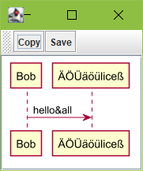

# PlantUML Swing Panel

This is a small tool to visualize [PlantUML](https://www.plantuml.com) diagrams in your own projects straight out of your source code.
If you try to generate a diagram out of any report (e.g. out of Excel with [POI](https://poi.apache.org/)), you have often to go the way of try-and-error until the tool or report generates the PlantUML code in the way you wish. This panel here gives you the RAPID way to display a PlantUML diagram you've generated in your source code yourself. The display uses SVG (the mighty fast [SVGSalamander](https://github.com/blackears/svgSalamander)).

See the example, which starts with ch.braincell.plantuml.swing.Main:

## How to Integrate:
After you've added the JPanel ch.braincell.plantuml.swing.panel.PlantPanel to a JFrame, use the method PlantPanel.renderPlant(String plantUML) to display the PlantUML diagram. And of course you'll need the libraries too (any version of [SVGSalamander](https://mvnrepository.com/artifact/guru.nidi.com.kitfox/svgSalamander) and [PlantUML](https://plantuml.com/en/download)). There are no more "chained dependencies".
The two required libraries have very stable API's. And PlantUML, although it has been around for over 10 years, has a very active development. So there's no harm in using the latest version that helps you the most.

## How to use:
* Button "Copy" copies a bitmap picture into your clipboard.
* Button "Save" gives you the option to save the picture either as SVG or PNG somewhere on your local storage.

If you hover the mouse over the panel:
* Pressing right mouse button resets the display to to the horizontal size of the window up to the 100% maximum.
* Pressing left mouse button allows moving around the picture if it is bigger than the window.
* Pressing [CTRL] and mousewheel allows zooming in and out.

If the content of the diagram changes, the zooming and position will be kept. this is not a bug, it's a feature ;-). The reason is: e.g. you'll position a Sequence diagram to a speicific position and you see a problem there, you can change the problem in that position and you won't loose the viewpoint.